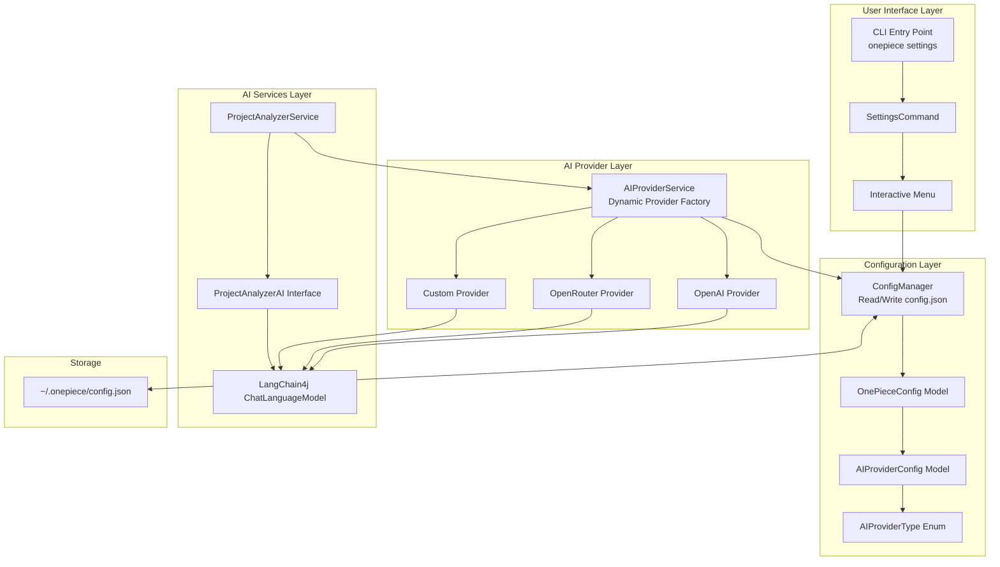
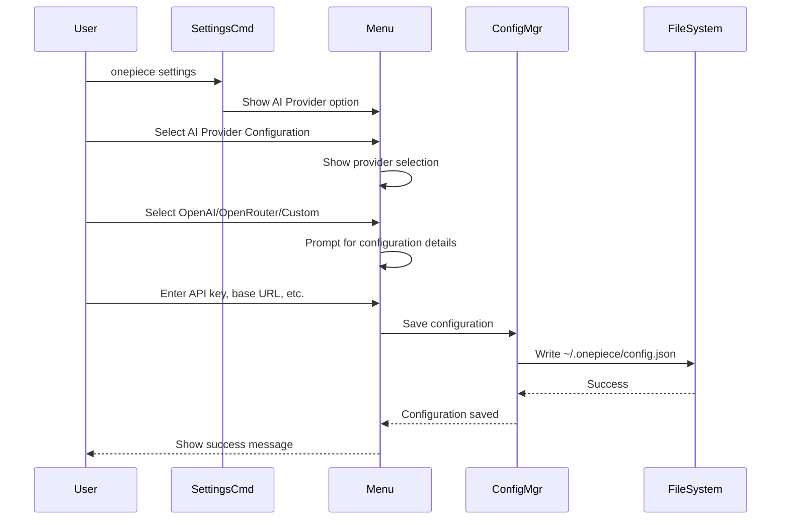
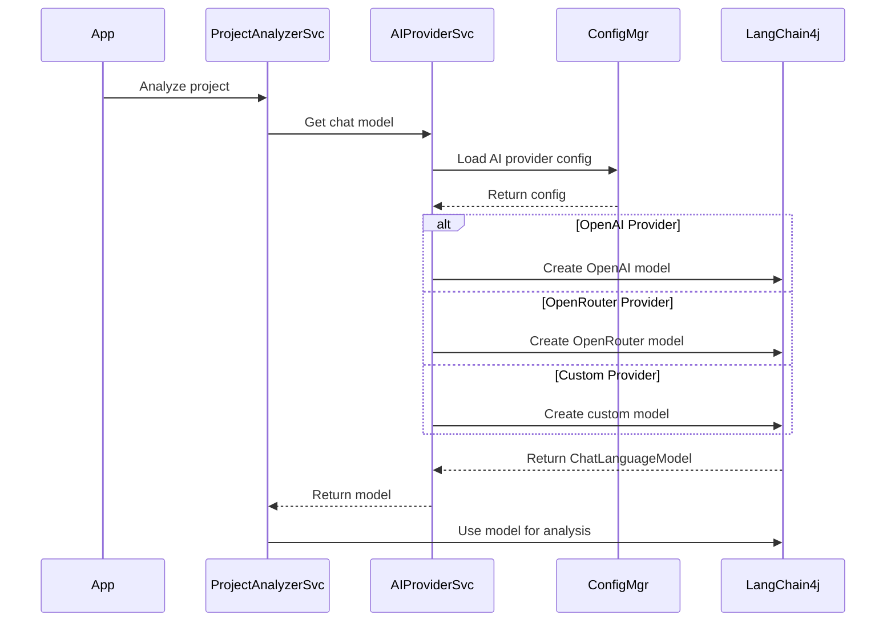
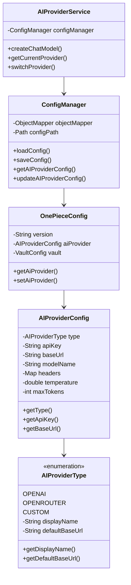
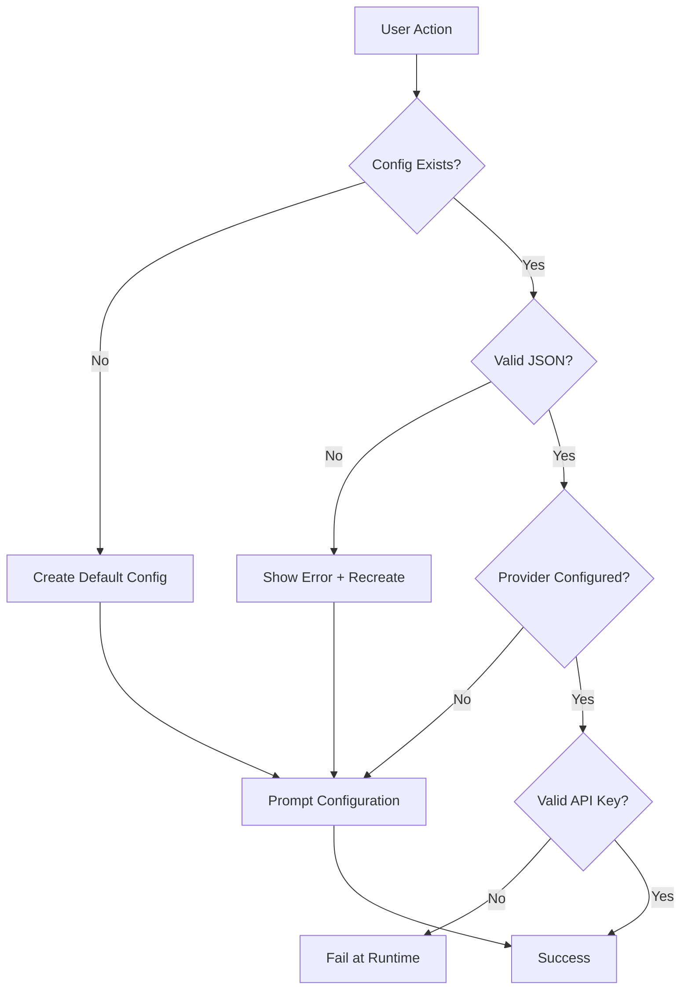

# AI Provider Configuration Architecture

## System Architecture Diagram



## Component Interaction Flow

### Configuration Flow



### AI Service Initialization Flow



## Data Model Structure



## File System Structure

```
~/.onepiece/
├── config.json                 # Main configuration
│   ├── version: "1.0.0"
│   ├── aiProvider:
│   │   ├── type: "OPENAI"
│   │   ├── apiKey: "sk-..."
│   │   ├── baseUrl: "https://..."
│   │   ├── modelName: "gpt-4"
│   │   ├── temperature: 0.7
│   │   ├── maxTokens: 2000
│   │   └── headers: {}
│   └── vault:
│       ├── url: "https://..."
│       └── token: "hvs...."
├── mcp-registry.json          # MCP servers
└── project.json               # Project metadata
```

## Provider Configuration Examples

### OpenAI Configuration
```json
{
  "version": "1.0.0",
  "aiProvider": {
    "type": "OPENAI",
    "apiKey": "sk-proj-...",
    "baseUrl": "https://api.openai.com/v1",
    "modelName": "gpt-4",
    "temperature": 0.7,
    "maxTokens": 2000,
    "headers": {}
  }
}
```

### OpenRouter Configuration
```json
{
  "version": "1.0.0",
  "aiProvider": {
    "type": "OPENROUTER",
    "apiKey": "sk-or-v1-...",
    "baseUrl": "https://openrouter.ai/api/v1",
    "modelName": "openai/gpt-4",
    "temperature": 0.7,
    "maxTokens": 2000,
    "headers": {
      "HTTP-Referer": "https://onepiece-cli.com",
      "X-Title": "One Piece CLI"
    }
  }
}
```

### Custom Provider Configuration
```json
{
  "version": "1.0.0",
  "aiProvider": {
    "type": "CUSTOM",
    "apiKey": "custom-api-key",
    "baseUrl": "https://custom-llm-api.example.com/v1",
    "modelName": "custom-model-v1",
    "temperature": 0.7,
    "maxTokens": 2000,
    "headers": {
      "X-Custom-Auth": "Bearer token",
      "X-Organization": "my-org"
    }
  }
}
```

## Settings Menu Structure

```
┌─────────────────────────────────────────┐
│  🔐 Settings - Configure Credentials    │
├─────────────────────────────────────────┤
│                                         │
│  Current Configuration:                 │
│    AI Provider: OpenAI (gpt-4)         │
│    Vault: Not configured               │
│                                         │
│  ? What would you like to do?          │
│                                         │
│  1. 🤖 AI Provider Configuration       │
│  2. 🔄 Update Vault configuration      │
│  3. 🧪 Test connection                 │
│  4. 📋 Show stored secrets (masked)    │
│  5. 🗑️  Reset configuration            │
│  6. 🔙 Back to main menu               │
│                                         │
└─────────────────────────────────────────┘
```

### AI Provider Configuration Submenu

```
┌─────────────────────────────────────────┐
│  🤖 AI Provider Configuration           │
├─────────────────────────────────────────┤
│                                         │
│  Current Provider: OpenAI              │
│  Model: gpt-4                          │
│  Status: ✓ Configured                  │
│                                         │
│  ? Select an option:                   │
│                                         │
│  1. 🔄 Change Provider                 │
│  2. ⚙️  Update Current Configuration    │
│  3. 📋 Show Configuration              │
│  4. 🔙 Back                            │
│                                         │
└─────────────────────────────────────────┘
```

### Provider Selection Menu

```
┌─────────────────────────────────────────┐
│  🤖 Select AI Provider                  │
├─────────────────────────────────────────┤
│                                         │
│  Choose your AI provider:              │
│                                         │
│  1. 🟢 OpenAI                          │
│     Most popular, GPT-4 support        │
│                                         │
│  2. 🔵 OpenRouter                      │
│     Access multiple models             │
│                                         │
│  3. ⚙️  Custom Provider                │
│     Use your own API endpoint          │
│                                         │
│  4. 🔙 Back                            │
│                                         │
└─────────────────────────────────────────┘
```

## Error Handling Strategy



## Security Considerations

1. **File Permissions**: Set `~/.onepiece/config.json` to 600 (user read/write only)
2. **API Key Storage**: Plain text in config file (warn users)
3. **Logging**: Never log API keys or sensitive headers
4. **Vault Integration**: Recommend Vault for production environments
5. **Input Validation**: Sanitize all user inputs before saving

## Performance Considerations

1. **Lazy Loading**: Load configuration only when needed
2. **Caching**: Cache ChatLanguageModel instances
3. **Provider Switching**: Minimal overhead, recreate model on switch
4. **File I/O**: Minimize config file reads/writes

---

**Status**: Architecture design complete, ready for implementation