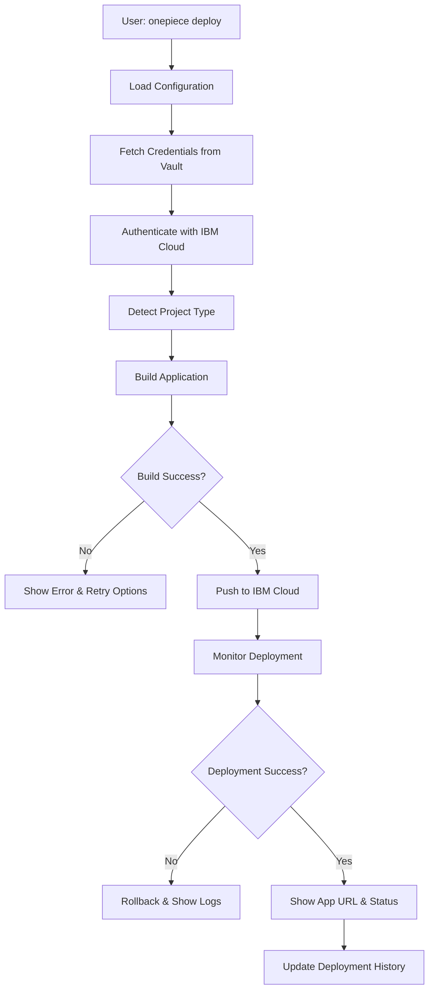

# ☁️ One Piece CLI - IBM Cloud Deployment Specification

## 1. Overview

One Piece CLI automates the complete deployment workflow to IBM Cloud, handling authentication, build, deployment, and monitoring. This specification defines the deployment process for the POC, focusing on IBM Cloud Foundry and Code Engine platforms.

### Supported IBM Cloud Services
- **Cloud Foundry** - Traditional PaaS deployment (POC Priority)
- **Code Engine** - Serverless container platform
- **Kubernetes Service (IKS)** - Container orchestration (Future)
- **Red Hat OpenShift** - Enterprise Kubernetes (Future)

---

## 2. Deployment Architecture

### 2.1 Deployment Flow



### 2.2 Component Architecture

```
DeploymentOrchestrator
├── CredentialManager (Vault integration)
├── IbmCloudAuthenticator (Login & token management)
├── ProjectBuilder (Maven, Gradle, npm, etc.)
├── DeploymentExecutor (Cloud Foundry, Code Engine)
├── LogStreamer (Real-time log output)
└── DeploymentMonitor (Health checks & status)
```

---

## 3. IBM Cloud CLI Integration

### 3.1 Prerequisites Check

```java
package com.nel.onepiece.deployment;

import jakarta.enterprise.context.ApplicationScoped;
import java.io.IOException;

@ApplicationScoped
public class IbmCloudPrerequisites {
    
    public PrerequisiteCheckResult checkPrerequisites() {
        List<String> errors = new ArrayList<>();
        List<String> warnings = new ArrayList<>();
        
        // Check IBM Cloud CLI installation
        if (!isIbmCloudCliInstalled()) {
            errors.add("IBM Cloud CLI is not installed");
        } else {
            String version = getIbmCloudCliVersion();
            if (!isVersionCompatible(version)) {
                warnings.add("IBM Cloud CLI version " + version + 
                    " may not be compatible. Recommended: 2.15.0+");
            }
        }
        
        // Check Cloud Foundry plugin
        if (!isCloudFoundryPluginInstalled()) {
            errors.add("Cloud Foundry plugin is not installed");
        }
        
        // Check Code Engine plugin (optional)
        if (!isCodeEnginePluginInstalled()) {
            warnings.add("Code Engine plugin is not installed (optional)");
        }
        
        return new PrerequisiteCheckResult(errors, warnings);
    }
    
    private boolean isIbmCloudCliInstalled() {
        try {
            ProcessResult result = executeCommand("ibmcloud", "--version");
            return result.exitCode() == 0;
        } catch (IOException e) {
            return false;
        }
    }
    
    private String getIbmCloudCliVersion() {
        ProcessResult result = executeCommand("ibmcloud", "--version");
        // Parse version from output
        return parseVersion(result.stdout());
    }
    
    private boolean isCloudFoundryPluginInstalled() {
        ProcessResult result = executeCommand("ibmcloud", "plugin", "list");
        return result.stdout().contains("cloud-foundry");
    }
    
    private boolean isCodeEnginePluginInstalled() {
        ProcessResult result = executeCommand("ibmcloud", "plugin", "list");
        return result.stdout().contains("code-engine");
    }
}
```

### 3.2 Installation Guide

If prerequisites are missing, provide installation instructions:

```
❌ Error: IBM Cloud CLI not found

One Piece CLI requires the IBM Cloud CLI to deploy applications.

📥 Install IBM Cloud CLI:

macOS/Linux:
  curl -fsSL https://clis.cloud.ibm.com/install/linux | sh

Windows:
  Download from: https://cloud.ibm.com/docs/cli

After installation, install required plugins:
  ibmcloud plugin install cloud-foundry
  ibmcloud plugin install code-engine

? Open installation guide in browser? (Y/n)
```

---

## 4. Credential Management

### 4.1 Vault Integration

```java
package com.nel.onepiece.deployment;

import jakarta.enterprise.context.ApplicationScoped;
import jakarta.inject.Inject;

@ApplicationScoped
public class IbmCloudCredentialManager {
    
    @Inject
    VaultClient vaultClient;
    
    @Inject
    ConfigurationManager configManager;
    
    public IbmCloudCredentials fetchCredentials() {
        // Load user config to get Vault settings
        UserConfig userConfig = configManager.getUserConfig();
        
        if (!userConfig.getVault().isEnabled()) {
            throw new CredentialException(
                "Vault is not configured. Run 'onepiece settings' to configure."
            );
        }
        
        // Fetch credentials from Vault
        String apiKey = vaultClient.getSecret("ibmcloud/api-key");
        String region = vaultClient.getSecret("ibmcloud/region");
        
        return new IbmCloudCredentials(apiKey, region);
    }
    
    public IbmCloudCredentials fetchCredentialsWithFallback() {
        try {
            return fetchCredentials();
        } catch (VaultException e) {
            // Fallback to environment variables
            String apiKey = System.getenv("IBM_CLOUD_API_KEY");
            String region = System.getenv("IBM_CLOUD_REGION");
            
            if (apiKey == null || region == null) {
                throw new CredentialException(
                    "Failed to fetch credentials from Vault and " +
                    "environment variables are not set"
                );
            }
            
            return new IbmCloudCredentials(apiKey, region);
        }
    }
}
```

### 4.2 Credential Security

```java
public class IbmCloudCredentials {
    private final String apiKey;
    private final String region;
    private final Instant expiresAt;
    
    public IbmCloudCredentials(String apiKey, String region) {
        this.apiKey = apiKey;
        this.region = region;
        this.expiresAt = Instant.now().plus(Duration.ofHours(1));
    }
    
    public String getApiKey() {
        if (isExpired()) {
            throw new CredentialException("Credentials have expired");
        }
        return apiKey;
    }
    
    public boolean isExpired() {
        return Instant.now().isAfter(expiresAt);
    }
    
    public String getMaskedApiKey() {
        if (apiKey.length() < 8) return "***";
        return apiKey.substring(0, 4) + "..." + apiKey.substring(apiKey.length() - 4);
    }
    
    @Override
    public String toString() {
        return "IbmCloudCredentials{apiKey=" + getMaskedApiKey() + 
               ", region=" + region + "}";
    }
}
```

---

## 5. Authentication & Login

### 5.1 IBM Cloud Authentication

```java
package com.nel.onepiece.deployment;

import jakarta.enterprise.context.ApplicationScoped;
import jakarta.inject.Inject;

@ApplicationScoped
public class IbmCloudAuthenticator {
    
    @Inject
    IbmCloudCredentialManager credentialManager;
    
    @Inject
    ProcessExecutor processExecutor;
    
    public AuthenticationResult authenticate() {
        // Fetch credentials
        IbmCloudCredentials credentials = credentialManager.fetchCredentials();
        
        // Login to IBM Cloud
        ProcessResult loginResult = processExecutor.execute(
            "ibmcloud", "login",
            "--apikey", credentials.getApiKey(),
            "--region", credentials.getRegion(),
            "--no-region" // Don't prompt for region
        );
        
        if (loginResult.exitCode() != 0) {
            return AuthenticationResult.failure(
                "Failed to authenticate with IBM Cloud: " + loginResult.stderr()
            );
        }
        
        // Target Cloud Foundry org and space
        ProcessResult targetResult = targetCloudFoundry();
        
        if (targetResult.exitCode() != 0) {
            return AuthenticationResult.failure(
                "Failed to target Cloud Foundry: " + targetResult.stderr()
            );
        }
        
        return AuthenticationResult.success();
    }
    
    private ProcessResult targetCloudFoundry() {
        // Get available orgs
        ProcessResult orgsResult = processExecutor.execute(
            "ibmcloud", "account", "orgs"
        );
        
        List<String> orgs = parseOrgs(orgsResult.stdout());
        
        if (orgs.isEmpty()) {
            throw new DeploymentException("No Cloud Foundry organizations found");
        }
        
        // Use first org (or prompt user)
        String org = orgs.get(0);
        
        // Get available spaces
        ProcessResult spacesResult = processExecutor.execute(
            "ibmcloud", "account", "spaces", "-o", org
        );
        
        List<String> spaces = parseSpaces(spacesResult.stdout());
        
        if (spaces.isEmpty()) {
            throw new DeploymentException("No Cloud Foundry spaces found");
        }
        
        String space = spaces.get(0);
        
        // Target org and space
        return processExecutor.execute(
            "ibmcloud", "target",
            "-o", org,
            "-s", space
        );
    }
}
```

### 5.2 Session Management

```java
@ApplicationScoped
public class IbmCloudSessionManager {
    
    private String currentToken;
    private Instant tokenExpiry;
    
    public boolean isAuthenticated() {
        if (currentToken == null) {
            return false;
        }
        
        if (Instant.now().isAfter(tokenExpiry)) {
            return false;
        }
        
        // Verify token is still valid
        ProcessResult result = processExecutor.execute(
            "ibmcloud", "account", "show"
        );
        
        return result.exitCode() == 0;
    }
    
    public void refreshAuthentication() {
        authenticator.authenticate();
        this.tokenExpiry = Instant.now().plus(Duration.ofHours(1));
    }
}
```

---

## 6. Project Build Process

### 6.1 Build Strategy Detection

```java
package com.nel.onepiece.deployment;

import jakarta.enterprise.context.ApplicationScoped;
import java.nio.file.Files;
import java.nio.file.Path;

@ApplicationScoped
public class ProjectBuilder {
    
    public BuildStrategy detectBuildStrategy(Path projectDir) {
        // Maven
        if (Files.exists(projectDir.resolve("pom.xml"))) {
            return new MavenBuildStrategy();
        }
        
        // Gradle
        if (Files.exists(projectDir.resolve("build.gradle")) ||
            Files.exists(projectDir.resolve("build.gradle.kts"))) {
            return new GradleBuildStrategy();
        }
        
        // Node.js
        if (Files.exists(projectDir.resolve("package.json"))) {
            return new NpmBuildStrategy();
        }
        
        // Python
        if (Files.exists(projectDir.resolve("requirements.txt")) ||
            Files.exists(projectDir.resolve("setup.py"))) {
            return new PythonBuildStrategy();
        }
        
        throw new BuildException("Unable to detect build strategy");
    }
    
    public BuildResult build(Path projectDir) {
        BuildStrategy strategy = detectBuildStrategy(projectDir);
        return strategy.build(projectDir);
    }
}
```

### 6.2 Maven Build Strategy

```java
public class MavenBuildStrategy implements BuildStrategy {
    
    @Override
    public BuildResult build(Path projectDir) {
        // Check if Maven is installed
        if (!isMavenInstalled()) {
            return BuildResult.failure("Maven is not installed");
        }
        
        // Clean and package
        ProcessResult result = processExecutor.execute(
            projectDir,
            "mvn", "clean", "package", "-DskipTests"
        );
        
        if (result.exitCode() != 0) {
            return BuildResult.failure(
                "Maven build failed: " + result.stderr()
            );
        }
        
        // Find generated artifact
        Path targetDir = projectDir.resolve("target");
        Path artifact = findArtifact(targetDir);
        
        if (artifact == null) {
            return BuildResult.failure("No artifact found in target directory");
        }
        
        return BuildResult.success(artifact);
    }
    
    private Path findArtifact(Path targetDir) {
        try (var paths = Files.walk(targetDir, 1)) {
            return paths
                .filter(p -> p.toString().endsWith(".jar") || 
                            p.toString().endsWith(".war"))
                .filter(p -> !p.toString().contains("sources"))
                .filter(p -> !p.toString().contains("javadoc"))
                .findFirst()
                .orElse(null);
        } catch (IOException e) {
            return null;
        }
    }
}
```

### 6.3 Build Progress Monitoring

```java
@ApplicationScoped
public class BuildProgressMonitor {
    
    public void monitorBuild(Process buildProcess) {
        BufferedReader reader = new BufferedReader(
            new InputStreamReader(buildProcess.getInputStream())
        );
        
        String line;
        while ((line = reader.readLine()) != null) {
            // Parse build output for progress
            if (line.contains("[INFO] Building")) {
                System.out.println("⏳ " + line);
            } else if (line.contains("[INFO] BUILD SUCCESS")) {
                System.out.println("✓ Build successful");
            } else if (line.contains("[ERROR]")) {
                System.err.println("❌ " + line);
            }
        }
    }
}
```

---

## 7. Cloud Foundry Deployment

### 7.1 Manifest Generation

```java
package com.nel.onepiece.deployment.cloudfoundry;

import jakarta.enterprise.context.ApplicationScoped;

@ApplicationScoped
public class CloudFoundryManifestGenerator {
    
    public void generateManifest(Path projectDir, DeploymentConfig config) {
        CloudFoundryManifest manifest = new CloudFoundryManifest();
        
        // Application configuration
        manifest.addApplication(app -> {
            app.setName(config.getAppName());
            app.setMemory(config.getMemory());
            app.setInstances(config.getInstances());
            app.setPath(config.getArtifactPath());
            app.setBuildpack(detectBuildpack(projectDir));
            app.setHealthCheckType("http");
            app.setHealthCheckHttpEndpoint("/health");
            app.setTimeout(180);
            
            // Environment variables
            if (config.getEnvVars() != null) {
                app.setEnv(config.getEnvVars());
            }
            
            // Services (databases, etc.)
            if (config.getServices() != null) {
                app.setServices(config.getServices());
            }
            
            // Routes
            if (config.getRoutes() != null) {
                app.setRoutes(config.getRoutes());
            }
        });
        
        // Write manifest.yml
        Path manifestPath = projectDir.resolve("manifest.yml");
        writeYaml(manifestPath, manifest);
    }
    
    private String detectBuildpack(Path projectDir) {
        if (Files.exists(projectDir.resolve("pom.xml"))) {
            return "java_buildpack";
        } else if (Files.exists(projectDir.resolve("package.json"))) {
            return "nodejs_buildpack";
        } else if (Files.exists(projectDir.resolve("requirements.txt"))) {
            return "python_buildpack";
        }
        return null; // Auto-detect
    }
}
```

### 7.2 Example manifest.yml

```yaml
---
applications:
- name: ecommerce-api
  memory: 512M
  instances: 1
  path: target/ecommerce-api-1.0.0.jar
  buildpack: java_buildpack
  health-check-type: http
  health-check-http-endpoint: /health
  timeout: 180
  env:
    JBP_CONFIG_OPEN_JDK_JRE: '{ jre: { version: 21.+ } }'
    JAVA_OPTS: '-Xmx384m -Xss512k'
  services:
  - postgres-db
  - redis-cache
  routes:
  - route: ecommerce-api.us-south.cf.appdomain.cloud
```

### 7.3 Cloud Foundry Push

```java
@ApplicationScoped
public class CloudFoundryDeployer {
    
    @Inject
    ProcessExecutor processExecutor;
    
    @Inject
    LogStreamer logStreamer;
    
    public DeploymentResult deploy(Path projectDir, DeploymentConfig config) {
        // Generate manifest
        manifestGenerator.generateManifest(projectDir, config);
        
        // Push application
        Process pushProcess = processExecutor.startProcess(
            projectDir,
            "ibmcloud", "cf", "push", config.getAppName()
        );
        
        // Stream logs in real-time
        logStreamer.streamLogs(pushProcess);
        
        // Wait for completion
        int exitCode = pushProcess.waitFor();
        
        if (exitCode != 0) {
            return DeploymentResult.failure("Deployment failed");
        }
        
        // Get app info
        AppInfo appInfo = getAppInfo(config.getAppName());
        
        return DeploymentResult.success(appInfo);
    }
    
    private AppInfo getAppInfo(String appName) {
        ProcessResult result = processExecutor.execute(
            "ibmcloud", "cf", "app", appName
        );
        
        return parseAppInfo(result.stdout());
    }
}
```

---

## 8. Code Engine Deployment

### 8.1 Container Build

```java
package com.nel.onepiece.deployment.codeengine;

import jakarta.enterprise.context.ApplicationScoped;

@ApplicationScoped
public class CodeEngineDeployer {
    
    public DeploymentResult deploy(Path projectDir, DeploymentConfig config) {
        // Build container image
        String imageName = buildContainerImage(projectDir, config);
        
        // Push to IBM Cloud Container Registry
        pushToRegistry(imageName);
        
        // Deploy to Code Engine
        return deployToCodeEngine(imageName, config);
    }
    
    private String buildContainerImage(Path projectDir, DeploymentConfig config) {
        String imageName = config.getAppName() + ":latest";
        
        // Check if Dockerfile exists
        if (!Files.exists(projectDir.resolve("Dockerfile"))) {
            // Generate Dockerfile
            generateDockerfile(projectDir);
        }
        
        // Build image
        ProcessResult result = processExecutor.execute(
            projectDir,
            "docker", "build",
            "-t", imageName,
            "."
        );
        
        if (result.exitCode() != 0) {
            throw new DeploymentException("Docker build failed: " + result.stderr());
        }
        
        return imageName;
    }
    
    private void pushToRegistry(String imageName) {
        // Tag for IBM Cloud Container Registry
        String registryImage = "us.icr.io/namespace/" + imageName;
        
        processExecutor.execute(
            "docker", "tag", imageName, registryImage
        );
        
        // Push to registry
        ProcessResult result = processExecutor.execute(
            "docker", "push", registryImage
        );
        
        if (result.exitCode() != 0) {
            throw new DeploymentException("Failed to push image: " + result.stderr());
        }
    }
    
    private DeploymentResult deployToCodeEngine(String imageName, DeploymentConfig config) {
        // Create or update Code Engine application
        ProcessResult result = processExecutor.execute(
            "ibmcloud", "ce", "application", "create",
            "--name", config.getAppName(),
            "--image", "us.icr.io/namespace/" + imageName,
            "--cpu", config.getCpu(),
            "--memory", config.getMemory(),
            "--min-scale", "0",
            "--max-scale", config.getMaxInstances().toString(),
            "--port", config.getPort().toString()
        );
        
        if (result.exitCode() != 0) {
            return DeploymentResult.failure("Code Engine deployment failed: " + result.stderr());
        }
        
        // Get application URL
        String appUrl = getCodeEngineAppUrl(config.getAppName());
        
        return DeploymentResult.success(new AppInfo(config.getAppName(), appUrl));
    }
}
```

---

## 9. Log Streaming

### 9.1 Real-time Log Streamer

```java
package com.nel.onepiece.deployment;

import jakarta.enterprise.context.ApplicationScoped;
import java.io.BufferedReader;
import java.io.InputStreamReader;

@ApplicationScoped
public class LogStreamer {
    
    public void streamLogs(Process process) {
        Thread stdoutThread = new Thread(() -> {
            try (BufferedReader reader = new BufferedReader(
                new InputStreamReader(process.getInputStream()))) {
                
                String line;
                while ((line = reader.readLine()) != null) {
                    formatAndPrintLog(line, LogLevel.INFO);
                }
            } catch (IOException e) {
                // Handle error
            }
        });
        
        Thread stderrThread = new Thread(() -> {
            try (BufferedReader reader = new BufferedReader(
                new InputStreamReader(process.getErrorStream()))) {
                
                String line;
                while ((line = reader.readLine()) != null) {
                    formatAndPrintLog(line, LogLevel.ERROR);
                }
            } catch (IOException e) {
                // Handle error
            }
        });
        
        stdoutThread.start();
        stderrThread.start();
    }
    
    private void formatAndPrintLog(String line, LogLevel level) {
        String timestamp = Instant.now().toString();
        String prefix = level == LogLevel.ERROR ? "❌" : "📝";
        
        System.out.println(String.format("[%s] %s %s", timestamp, prefix, line));
    }
    
    public void streamCloudFoundryLogs(String appName) {
        Process logsProcess = processExecutor.startProcess(
            "ibmcloud", "cf", "logs", appName, "--recent"
        );
        
        streamLogs(logsProcess);
    }
}
```

### 9.2 Log Formatting

```
Deployment Logs:
────────────────────────────────────────
[2026-05-02 17:45:00] 📝 Uploading app files...
[2026-05-02 17:45:15] 📝 Processing app files...
[2026-05-02 17:45:20] 📝 Staging app...
[2026-05-02 17:45:45] 📝 Starting app...
[2026-05-02 17:46:00] ✓ App started successfully
────────────────────────────────────────
```

---

## 10. Deployment Monitoring

### 10.1 Health Check Service

```java
@ApplicationScoped
public class DeploymentMonitor {
    
    public HealthStatus checkHealth(String appUrl) {
        try {
            HttpClient client = HttpClient.newHttpClient();
            HttpRequest request = HttpRequest.newBuilder()
                .uri(URI.create(appUrl + "/health"))
                .timeout(Duration.ofSeconds(10))
                .GET()
                .build();
            
            HttpResponse<String> response = client.send(
                request,
                HttpResponse.BodyHandlers.ofString()
            );
            
            if (response.statusCode() == 200) {
                return HealthStatus.HEALTHY;
            } else {
                return HealthStatus.UNHEALTHY;
            }
        } catch (Exception e) {
            return HealthStatus.UNREACHABLE;
        }
    }
    
    public void waitForHealthy(String appUrl, Duration timeout) {
        Instant deadline = Instant.now().plus(timeout);
        
        while (Instant.now().isBefore(deadline)) {
            HealthStatus status = checkHealth(appUrl);
            
            if (status == HealthStatus.HEALTHY) {
                return;
            }
            
            try {
                Thread.sleep(5000); // Check every 5 seconds
            } catch (InterruptedException e) {
                Thread.currentThread().interrupt();
                throw new DeploymentException("Health check interrupted");
            }
        }
        
        throw new DeploymentException("Application failed to become healthy within timeout");
    }
}
```

### 10.2 Deployment Status Tracking

```java
@ApplicationScoped
public class DeploymentStatusTracker {
    
    public DeploymentStatus getStatus(String appName) {
        ProcessResult result = processExecutor.execute(
            "ibmcloud", "cf", "app", appName
        );
        
        if (result.exitCode() != 0) {
            return DeploymentStatus.UNKNOWN;
        }
        
        String output = result.stdout();
        
        if (output.contains("running")) {
            return DeploymentStatus.RUNNING;
        } else if (output.contains("starting")) {
            return DeploymentStatus.STARTING;
        } else if (output.contains("stopped")) {
            return DeploymentStatus.STOPPED;
        } else if (output.contains("crashed")) {
            return DeploymentStatus.CRASHED;
        }
        
        return DeploymentStatus.UNKNOWN;
    }
    
    public void trackDeployment(String appName) {
        System.out.println("⏳ Monitoring deployment...");
        
        while (true) {
            DeploymentStatus status = getStatus(appName);
            
            switch (status) {
                case RUNNING:
                    System.out.println("✓ Application is running");
                    return;
                case CRASHED:
                    System.out.println("❌ Application crashed");
                    throw new DeploymentException("Application crashed during startup");
                case STARTING:
                    System.out.println("⏳ Application is starting...");
                    break;
                default:
                    System.out.println("⚠️ Unknown status: " + status);
            }
            
            try {
                Thread.sleep(3000);
            } catch (InterruptedException e) {
                Thread.currentThread().interrupt();
                return;
            }
        }
    }
}
```

---

## 11. Rollback Strategy

### 11.1 Rollback Implementation

```java
@ApplicationScoped
public class DeploymentRollback {
    
    public RollbackResult rollback(String appName) {
        // Get deployment history
        List<Deployment> history = getDeploymentHistory(appName);
        
        if (history.size() < 2) {
            return RollbackResult.failure("No previous deployment to rollback to");
        }
        
        // Get previous successful deployment
        Deployment previousDeployment = history.get(1);
        
        // Rollback to previous version
        ProcessResult result = processExecutor.execute(
            "ibmcloud", "cf", "rollback", appName,
            "--version", previousDeployment.getVersion()
        );
        
        if (result.exitCode() != 0) {
            return RollbackResult.failure("Rollback failed: " + result.stderr());
        }
        
        return RollbackResult.success(previousDeployment);
    }
    
    public void createDeploymentSnapshot(String appName) {
        // Save current state for potential rollback
        DeploymentSnapshot snapshot = new DeploymentSnapshot();
        snapshot.setAppName(appName);
        snapshot.setTimestamp(Instant.now());
        snapshot.setManifest(readManifest());
        snapshot.setEnvVars(getEnvVars(appName));
        
        saveSnapshot(snapshot);
    }
}
```

---

## 12. Deployment Configuration

### 12.1 Deployment Config Schema

```java
public class DeploymentConfig {
    private String appName;
    private String region;
    private String memory = "512M";
    private Integer instances = 1;
    private String buildpack;
    private Path artifactPath;
    private Map<String, String> envVars;
    private List<String> services;
    private List<String> routes;
    private Integer timeout = 180;
    private String healthCheckEndpoint = "/health";
    
    // Code Engine specific
    private String cpu = "0.25";
    private Integer maxInstances = 10;
    private Integer port = 8080;
    
    // Getters and setters
}
```

### 12.2 Example Deployment Configuration

```json
{
  "appName": "ecommerce-api",
  "region": "us-south",
  "platform": "cloud-foundry",
  "memory": "512M",
  "instances": 2,
  "buildpack": "java_buildpack",
  "envVars": {
    "JAVA_OPTS": "-Xmx384m",
    "DATABASE_URL": "${DATABASE_URL}",
    "REDIS_URL": "${REDIS_URL}"
  },
  "services": [
    "postgres-db",
    "redis-cache"
  ],
  "routes": [
    "ecommerce-api.us-south.cf.appdomain.cloud"
  ],
  "healthCheck": {
    "type": "http",
    "endpoint": "/health",
    "timeout": 180
  },
  "scaling": {
    "minInstances": 1,
    "maxInstances": 5,
    "cpuThreshold": 80
  }
}
```

---

## 13. Complete Deployment Service

### 13.1 Orchestrator Implementation

```java
package com.nel.onepiece.deployment;

import jakarta.enterprise.context.ApplicationScoped;
import jakarta.inject.Inject;

@ApplicationScoped
public class DeploymentOrchestrator {
    
    @Inject IbmCloudPrerequisites prerequisites;
    @Inject IbmCloudCredentialManager credentialManager;
    @Inject IbmCloudAuthenticator authenticator;
    @Inject ProjectBuilder projectBuilder;
    @Inject CloudFoundryDeployer cfDeployer;
    @Inject DeploymentMonitor monitor;
    @Inject DeploymentStatusTracker statusTracker;
    @Inject LogStreamer logStreamer;
    
    public DeploymentResult deploy(Path projectDir, DeploymentConfig config) {
        try {
            // 1. Check prerequisites
            System.out.println("🔍 Checking prerequisites...");
            PrerequisiteCheckResult prereqResult = prerequisites.checkPrerequisites();
            if (!prereqResult.isSuccess()) {
                return DeploymentResult.failure("Prerequisites check failed", prereqResult);
            }
            
            // 2. Fetch credentials
            System.out.println("🔐 Fetching credentials from Vault...");
            IbmCloudCredentials credentials = credentialManager.fetchCredentials();
            System.out.println("   ✓ Credentials retrieved");
            
            // 3. Authenticate
            System.out.println("🔑 Authenticating with IBM Cloud...");
            AuthenticationResult authResult = authenticator.authenticate();
            if (!authResult.isSuccess()) {
                return DeploymentResult.failure("Authentication failed", authResult);
            }
            System.out.println("   ✓ Authenticated successfully");
            
            // 4. Build project
            System.out.println("📦 Building application...");
            BuildResult buildResult = projectBuilder.build(projectDir);
            if (!buildResult.isSuccess()) {
                return DeploymentResult.failure("Build failed", buildResult);
            }
            System.out.println("   ✓ Build successful (" + buildResult.getDuration() + "s)");
            
            // 5. Deploy to Cloud Foundry
            System.out.println("☁️  Deploying to IBM Cloud...");
            DeploymentResult deployResult = cfDeployer.deploy(projectDir, config);
            if (!deployResult.isSuccess()) {
                return deployResult;
            }
            
            // 6. Monitor deployment
            System.out.println("⏳ Monitoring deployment...");
            statusTracker.trackDeployment(config.getAppName());
            
            // 7. Health check
            System.out.println("🏥 Performing health check...");
            String appUrl = deployResult.getAppInfo().getUrl();
            monitor.waitForHealthy(appUrl, Duration.ofMinutes(3));
            System.out.println("   ✓ Application is healthy");
            
            // 8. Show deployment info
            System.out.println("\n✅ Deployment Complete!\n");
            System.out.println("🌐 Your app is live at:");
            System.out.println("   " + appUrl);
            System.out.println("\n📊 App Details:");
            System.out.println("   • Status: Running");
            System.out.println("   • Instances: " + config.getInstances());
            System.out.println("   • Memory: " + config.getMemory());
            
            return deployResult;
            
        } catch (Exception e) {
            return DeploymentResult.failure("Deployment failed: " + e.getMessage());
        }
    }
}
```

---

## 14. Error Handling & Recovery

### 14.1 Common Deployment Errors

| Error | Cause | Recovery Strategy |
|-------|-------|-------------------|
| Authentication Failed | Invalid API key | Prompt to update credentials |
| Build Failed | Compilation errors | Show build logs, suggest fixes |
| Insufficient Memory | App requires more memory | Suggest increasing memory allocation |
| Route Already Taken | Route conflict | Generate alternative route |
| Service Binding Failed | Service not found | List available services |
| Timeout | App took too long to start | Increase timeout, check logs |
| Crashed | App crashed during startup | Show crash logs, suggest debugging |

### 14.2 Error Recovery Implementation

```java
@ApplicationScoped
public class DeploymentErrorRecovery {
    
    public RecoveryAction handleError(DeploymentException error) {
        return switch (error.getType()) {
            case AUTHENTICATION_FAILED -> 
                RecoveryAction.promptForCredentials();
            case BUILD_FAILED -> 
                RecoveryAction.showBuildLogs();
            case INSUFFICIENT_MEMORY -> 
                RecoveryAction.suggestMemoryIncrease();
            case ROUTE_CONFLICT -> 
                RecoveryAction.generateAlternativeRoute();
            case TIMEOUT -> 
                RecoveryAction.increaseTimeout();
            case CRASHED -> 
                RecoveryAction.showCrashLogs();
            default -> 
                RecoveryAction.showGenericHelp();
        };
    }
}
```

---

## 15. Implementation Checklist

- [ ] Implement IBM Cloud CLI prerequisite checks
- [ ] Build credential management with Vault integration
- [ ] Create authentication and session management
- [ ] Implement project build strategies (Maven, Gradle, npm)
- [ ] Build Cloud Foundry deployment with manifest generation
- [ ] Implement Code Engine deployment with container build
- [ ] Create real-time log streaming
- [ ] Build deployment monitoring and health checks
- [ ] Implement rollback functionality
- [ ] Add comprehensive error handling and recovery
- [ ] Write deployment integration tests
- [ ] Document deployment workflows
- [ ] Create deployment troubleshooting guide

---

## 16. Future Enhancements

- **Blue-Green Deployment**: Zero-downtime deployments
- **Canary Releases**: Gradual rollout to subset of users
- **Auto-Scaling**: Dynamic scaling based on load
- **Multi-Region Deployment**: Deploy to multiple regions
- **Deployment Pipelines**: CI/CD integration
- **Cost Estimation**: Predict deployment costs
- **Performance Monitoring**: Track app performance metrics